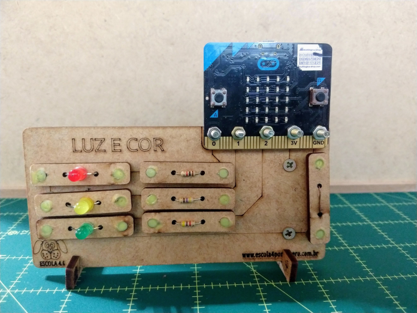
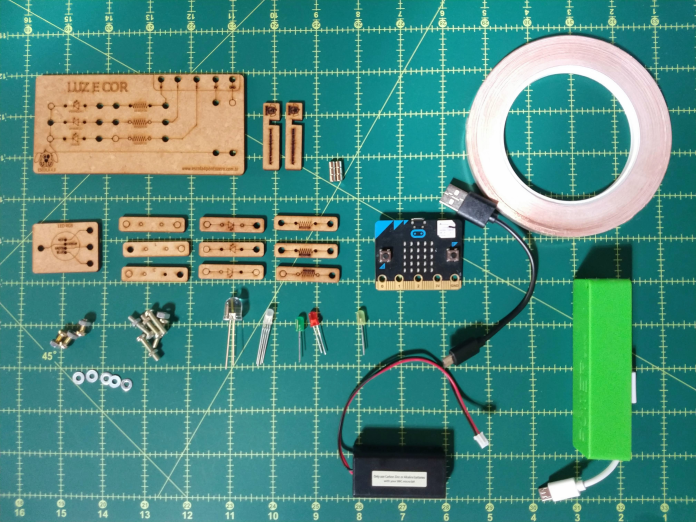
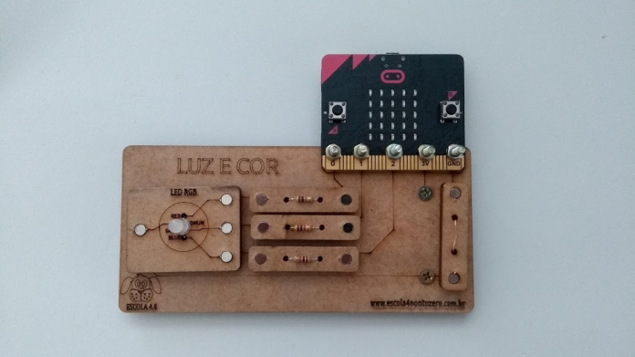
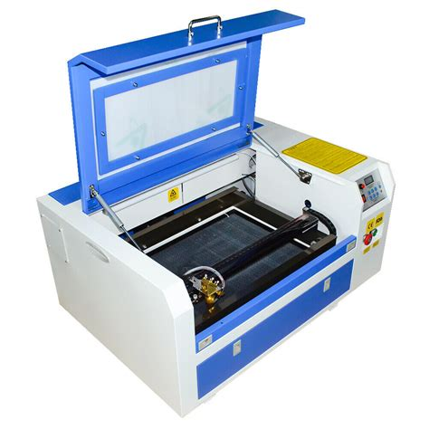
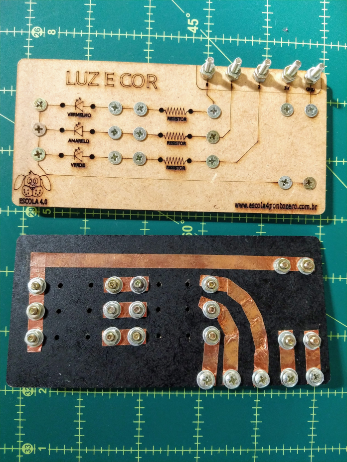
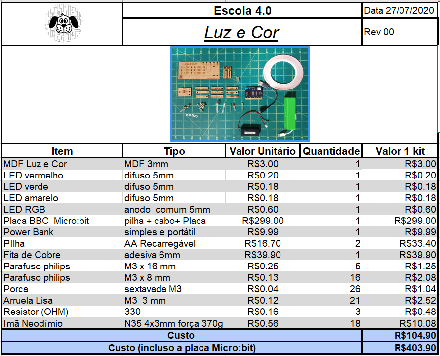

# Luz e Cor

A placa de MDF Luz e Cor permite a realização de experiências com LEDs usando a placa Micro:bit e kit kit de componentes

## Kit Luz e Cor Desmontado

## kit Luz e cor para Semáforo

## Kit Luz e cor para LED RGB

## Fabricação

A fabricação pode ser feita em cortadora laser.

Para as conexões eletricas pode-se usar fita de cobre

## Lista de materiais

